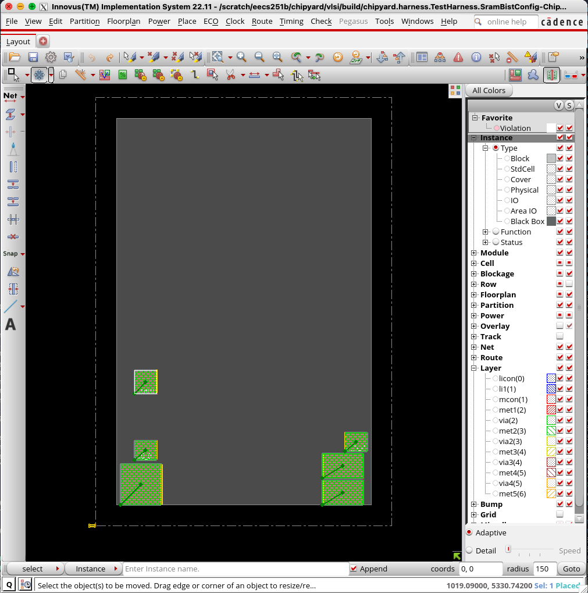
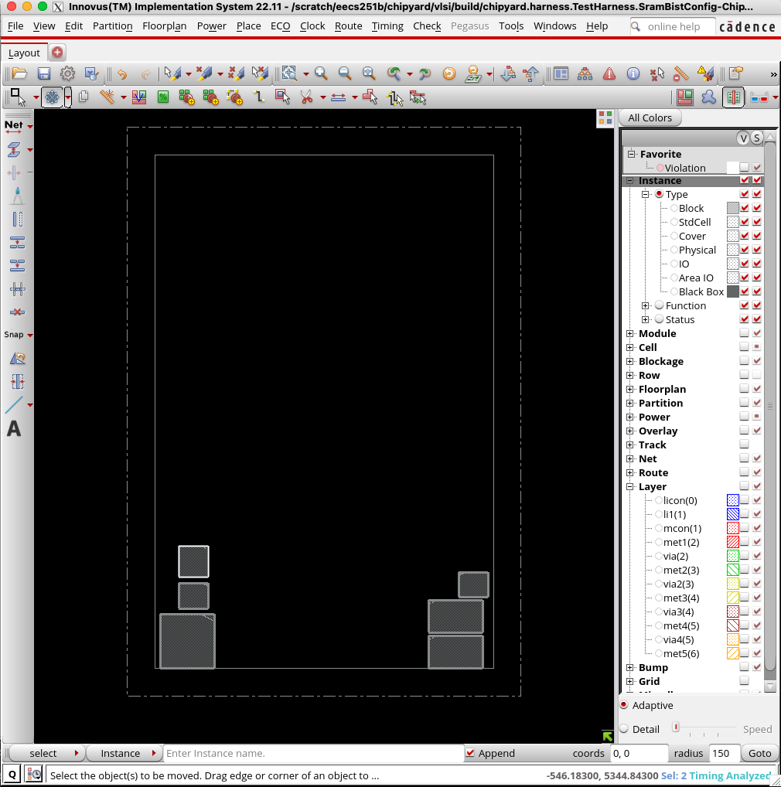

# Lab 3: VLSI flow

We will now synthesize, place-and-route, and validate the SoC you designed in Lab 2 using several VLSI tools.
We will be primarily using Hammer, a Berkeley-developed VLSI flow framework, 
but we will also see how to interact directly with the tools for more fine-grained control.

> [!WARNING]
> You will not be able to complete this lab without completing [Lab 2](../lab2) in its entirety.

## Getting started

Begin by pulling the latest starter code:

```
cd /scratch/$USER/chipyard
source env.sh
git pull skeleton main
./scripts/init-vlsi.sh sky130
```

> [!CAUTION]
> As a reminder, `hammer-synopsys-plugins` and `hammer-mentor-plugins` are private repos. PLEASE DO NOT PUBLISH THEM PUBLICLY.

## Hammer basics

Hammer is a Python framework for physical design.
One of the core driving ideas of Hammer is the separation of concerns.
All portions of the VLSI flow require information specific to the design, the 
technology used, and the CAD tools used. Hammer is designed to be a single backend
that exposes a single API for interacting with a variety of plugins.

As these flows can be complicated, there will always be special cases that don't
fit specifically into what Hammer has exposed to the user. Hammer is designed
to be highly configurable such that the designer can override any
default steps in the flow and add new ones.

A Hammer call generally looks like this:

```
hammer-vlsi <action> -e env.yml -p input.yml --obj_dir build
```

`hammer-vlsi` is the Hammer driver program (`hammer-vlsi` is the default one, but
you can write a driver that extends the provided base class to insert custom steps
into your flow — we will be using `eecs251b-vlsi`). `action` is a particular part of the
flow that you want to run (e.g. `syn`, `par`, `drc`, `lvs`, etc.).
`-e env.yml` includes `env.yml` as an environment config. `-p input.yml` includes
`input.yml` as a design input. `--obj_dir build` specifies that the outputs
should be placed in a subdirectory called build. We will start by using Chipyard's
`make` infrastructure to invoke Hammer commands for us, but later we will need to 
directly use our Hammer driver.

Hammer inputs are specified as keys in YAML and/or JSON files.
The inputs specific to this lab can be found in the YAML files within the `vlsi`
directory.

Check out the
[Hammer documentation](https://hammer-vlsi.readthedocs.io/en/stable/index.html)
if you want to explore the tool further.

## Macro collateral

In order to test our custom SRAM, we will need to tell Hammer where to find all of the relevant
information about the macro. Specifically, we will need to include files that specify:

1. Timing information
2. Simulation behavior
3. Pin and blockage geometry
4. Layout

Open up `vlsi/sky130.yml`. At the bottom, you will find 3 libraries that provide the necessary files for our macro,
each corresponding to a different PVT corner.

> [!IMPORTANT]
> **Question 1.** Match each of the four file types specified in the libraries to one of the four functions listed
> above. For the most part, you should be able to find the necessary information via searching online.
> You can also open some of the files (LEF, LIB, and Verilog) in a text editor to determine their purpose. GDS
> is a binary format, so you will need to use KLayout or CalibreDRV.

> [!TIP]
> You are free to copy the macro files off of the server or clone the Chipyard repo locally for easier viewing since
> SKY 130 is an open-source process.

Before continuing, modify the paths to point to your clone of the macro files. You can do this quickly with a `sed` command
or use your favorite text editor. For example:

```diff
-verilog_sim: "/scratch/eecs251b/chipyard/vlsi/macros/sram22_64x32m4w32_macro/sram22_64x32m4w32_macro.v"
+verilog_sim: "/scratch/eecs251b-<3 letter code>/sp24-chipyard-<github username>/vlsi/macros/sram22_64x32m4w32_macro/sram22_64x32m4w32_macro.v"
```

## Cadence Genus

Genus is a hardware synthesis tool takes an RTL hardware description
and a standard cell library as input and produces a gate-level netlist as an output.
The resulting gate-level netlist is a completely structural description with only
standard cells at the leaves of the design.

> [!IMPORTANT]
> **Question 2.** Examine `vlsi/design.yml`. What is the clock frequency that is
> initially specified for the design?

Note that the clock uncertainty is also specified in the same Hammer key. Clock
uncertainty is included to add margin to design timing to account for certain
clock non-idealities such as jitter. This value can be selected based off of 
knowledge of your clock source.

Now, run the following command from the `vlsi/` directory (this may take an hour or more):

```
make CONFIG=SramBistConfig syn
```

The synthesis results are placed into `vlsi/build/chipyard.harness.TestHarness.SramBistConfig-ChipTop/syn-rundir`. 
First, look at `syn.tcl`, which is generated by Hammer to tell Genus what to do. 

> [!TIP]
> There are several different commands in the TCL script. Some of the important ones include:
> - `puts` prints out messages to allow us to keep track of where we are in the script.
> - `write_db` writes the current Innovus state to a directory in `par-rundir/`.
> - `source` runs the specified TCL script.
> 
> For comprehensive documentation on Genus TCL commands, take a look at 
> `/share/instsww/cadence/DDI221/GENUS221/doc/genus_comref/genus_comref.pdf`.

> [!IMPORTANT]
> **Question 3.** Looking in `clock_constraints_fragment.sdc`, what command did Hammer use to translate
> the desired clock frequency specified in `vlsi/design.yml` to something Genus can understand?
>
>
> **Quesiton 4.** How does `clock_constraints_fragment.sdc` end up being evaluated from `syn.tcl`? Specifically,
> use `grep` to backtrace which TCL commands ultimately include the SDC file. Tthere should be two commands, 
> one from `syn.tcl` and one from another TCL script).
>
>
> **Question 5.** Which two commands in `syn.tcl` actually run synthesis? Try looking for `pre_syn`, which
> will help you find approximately where synthesis starts. What
> is the difference between those two commands?

In the `reports/` sub-directory of the run directory, there are various reports for the design.
Take a look at `final_time_ss_100C_1v60.setup_view.rpt`. This report specifies
the timing results of the design. It lists the critical path of the design first.

> [!IMPORTANT]
> **Question 6.** How much slack is there?
>
>
> **Question 7.** The nominal supply voltage for this technology is 1.8V. Why does the
> timing library report specify 1.6V (`1v60`) and 100C (temperature)?

> [!NOTE]
> If any of your paths were marked as (VIOLATED) instead of (MET), you would need to modify
> `vlsi/design.yml` to increase the clock period. If you do not do this, your
> design will not function properly. If you make your clock period
> too tight for a given design, the tools (synthesis and place-and-route)
> will have trouble doing their jobs and the run time will increase. After 
> changing the clock frequency, you would re-run synthesis and check the
> report again.
> 
> Conversely, if all your paths are (MET), you can find the true minimum clock
> period that our circuit can synthesize at by tightening the clock period and
> re-synthesizing until you reach near 0ps of positive slack If you
> do try this, be sure to re-synthesize again with the original clock period
> before continuing on with the lab.
>
> For the purposes of this lab, you do not need to rerun synthesis to fix timing violations or optimize your design.

## Cadence Innovus

Innovus is a place-and-route tool takes a synthesized gate-level
netlist and a standard cell library as input and produces a layout as output.
There are many steps in the P&R process, but here we will focus on high level
concepts. 

### Floorplanning

Floorplanning involves setting your boundaries and placing macros, among other things.
We have several macros in this design, each of which has been assigned an initial placement
in `vlsi/design.yml` under the key `vlsi.inputs.placement_constraints`.

> [!IMPORTANT]
> **Question 8.** Briefly describe the purpose of each macro placed in `vlsi/design.yml`. As a hint,
> they are all SRAM macros and the paths are quite descriptive.

Ideally, we would like to see what are floorplan looks like before we start a long P&R run. 
The following command stops P&R after a specified step, but we first need to find out what the step name is:

```
make CONFIG=SramBistConfig HAMMER_EXTRA_ARGS="--stop_after_step <step_name>" par
```

We can do this by looking at `vlsi/hammer/hammer/par/innovus/__init__.py`. Look for a function called `steps`,
which will specify all of the steps involved in running Innovus on a design.

> [!IMPORTANT]
> **Question 9.** What are the P&R steps outlined by the Hammer Innovus plugin? Which step do we probably want to
> stop on?

Using the step name you acquired, run the above command to run P&R up to the floorplanning step. This will
create `vlsi/build/chipyard.harness.TestHarness.SramBistConfig-ChipTop/par-rundir/`, which contains all Hammer- and Innovus-generated P&R files.

To see how Hammer translates our commands and design constraints to a format that Innovus can understand, 
open `par-rundir/par.tcl`. Look for the section in the TCL script where floorplanning happens.

> [!TIP]
> For comprehensive documentation on Innovus TCL commands, take a look at 
> `/share/instsww/cadence/DDI221/INNOVUS221/doc/TCRcom/TCRcom.pdf`.
>
> To find where floorplanning happens, you may want to find where the `pre_floorplan_design` and 
> `post_floorplan_design` databases are written.

> [!IMPORTANT]
> **Question 10.** Which line of `par.tcl` actually does the floorplanning?
>
>
> **Question 11.** The line you found in the previous question should reference another TCL script. 
> Looking at that TCL script now, which TCL command does Hammer use to tell Innovus
> about the placement constraints we specified in `vlsi/design.yml`?
>
>
> **Question 12.** Going back to `par.tcl`, you may notice that the last command before `exit` is:
> ```
> ln -sfn post_floorplan_design latest
> ```
> This is a Linux command. What does it do?
>
>
> **Question 13.** Open `par-rundir/generated-scripts/open-chip.tcl`. The last command is
> ```
> read_db latest
> ```
> How does this relate to the `ln -sfn` command in the previous question?

To view the floorplan design, run the following from the `par-rundir/` directory. Make sure you are using X2Go
or some other method of window forwarding so that you can view the Innovus GUI.

```
./generated-scripts/open_chip
```

> [!WARNING]
> Remember to point X2Go to the same machine that you used for the rest of the lab. Your `/scratch` directory
> will not be available on other machines.

Your floorplan should look something like this:



It is reasonable, but one of the SRAMs is a bit too high up. We will first move it temporarily to
find a placement that looks a bit better, then copy the placement parameters into `vlsi/design.yml`.

To move the SRAM temporarily, we first need to show only the instances that we want
to move so that we do not accidentally move other components of the database. 
Click the `V` button at the top of the right hand menu to hide everything, then click on the checkbox next to
`Instance` in the same column to make instances visible. Your GUI should now look like this:


We can now move the SRAM to a better location in a couple of ways, two of which are listed below:

1. Select the `Move/Resize/Reshape` tool at the top left or hitting `Shift + R`, then click on the SRAM that you want to move. Move it down a bit, then click again to place it. You will notice that the coordinates will show up
  in the terminal you started Innovus from.
2. Run the command you found earlier in the floorplanning script with modified coordinates in the Innovus CLI, 
which should have automatically opened in the terminal you started Innovus from.




We now need to tell Hammer about the placement we came up with in the GUI, since next time we run P&R it will simply 
overwrite our placement with the placement we specified in `vlsi/design.yml`. Update `vlsi/design.yml` with the 
appropriate coordinates based on your experimentation in the GUI.

> [!TIP]
> If we happened to move all of our SRAMs
> around in the GUI and want to know their coordinates, we can run the following in the Innovus command line which should have opened
> in the terminal you ran `./generated-scripts/open_chip` from:
> 
> ```
> report_property [get_cells -hierarchical * -filter {ref_lib_cell_name=~sram22*}] -property_list {hierarchical_name x_coordinate_min y_coordinate_min}
> ```
> 
> Copy over the updated coordinates for the SRAM that you moved into `vlsi/design.yml`. If you 
> don't want to type the numbers manually, you can even redirect the output into a file and 
> copy-paste from the outputted `par-rundir/placements.out`:
> 
> ```
> report_property [get_cells -hierarchical * -filter {ref_lib_cell_name=~sram22*}] -property_list {hierarchical_name x_coordinate_min y_coordinate_min} > placements.out
> ```

Once you have updated `vlsi/design.yml`, try rerunning the command that stops P&R after floorplanning:

```
make CONFIG=SramBistConfig HAMMER_EXTRA_ARGS="--stop_after_step floorplan_design" par
```

You might notice you run into an error related to synthesis, even though we are trying to run P&R. This is a limitation of using `make`,
which will rerun all steps if the configuration changes. Luckily, Hammer provides a way arounds this. Try running
the following command instead and open the result in another terminal:

```
make CONFIG=SramBistConfig HAMMER_EXTRA_ARGS="--stop_after_step floorplan_design" redo-par
```

You will find that your layout changes were not actually propagated. This is because Hammer caches the configuration
inputs to ensure consistency between synthesis and P&R in `build/chipyard.harness.TestHarness.SramBistConfig-ChipTop/par-input.json`. By default, the cached configuration is given priority. We will now need to manually use our CLI driver to use our modified configuration without rerunning synthesis:

```
./eecs251b-vlsi -e env.yml -p build/chipyard.harness.TestHarness.SramBistConfig-ChipTop/par-input.json \
  -p design.yml --obj_dir build/chipyard.harness.TestHarness.SramBistConfig-ChipTop/ \
  --stop_after_step <step_name> par
```

Since we specified `design.yml` after the cached configuration, the new design constraints will overwrite the cached ones.
You should now be able to see your updated placements reflected in Innovus when you open the database.

Let's now run P&R  from the `vlsi/` directory (this may take an hour or more, so make sure your floorplan looks correct first):

```
./eecs251b-vlsi -e env.yml -p build/chipyard.harness.TestHarness.SramBistConfig-ChipTop/par-input.json \
  -p design.yml --obj_dir build/chipyard.harness.TestHarness.SramBistConfig-ChipTop/ par
```

Once P&R completes, open the final design in the GUI:

```
cd build/chipyard.harness.TestHarness.SramBistConfig-ChipTop/par-rundir
./generated-scripts/open_chip
```

To see how your custom peripheral looks, type `system/srambist` in the search bar at the bottom of the GUI and hit enter.
This should select the SRAM you are testing and all of the digital circuitry corresponding to the RTL you wrote
in Lab 1.

> [!IMPORTANT]
> **Question 14.** Submit a screenshot of your design with your SRAM BIST selected. Make sure to include
> the entire Innovus window such that the path at the top of the window is visible.

## Cadence Pegasus

Pegasus is a tool for validating that your design meets foundry-provided rules and corresponds to the circuit
that you programmed in Chisel.

### Design Rule Checking (DRC)

Run the following commands in the `vlsi/` directory to run DRC:

```
make CONFIG=SramBistConfig redo-par-to-drc
make CONFIG=SramBistConfig redo-drc
cd build/chipyard.harness.TestHarness.SramBistConfig-ChipTop/drc-rundir
./generated-scripts/view_drc
```

This will open Pegasus Results Viewer. 
 
You do not need to fix any violations, but it is a good exercise to click through some errors 
in the violation browser and understand how they correspond to the
[SKY130 design rule manual](https://skywater-pdk.readthedocs.io/en/main/rules/periphery.html).
Creating a fabrication-ready design involves systematically reducing violations by modifying P&R as 
necessary until the number of violations is small enough to fix by hand.

> [!IMPORTANT]
> **Question 15.** The design has a lot of errors corresponding to rule `m3.6`. 
> Double click on one instance of the error and 
> submit a screenshot of both the result you selected and the corresponding geometry in the layout viewer.
>
>
> **Question 16.**
> What does the `m3.6` rule check? Zooming out a bit, do you have any hypotheses as to why these errors are
> popping up? As a hint, we excluded the SRAMs from DRC since they are allowed to violate the standard
> DRC rules.

### Layout vs. Schematic (LVS)

Run the following commands in the `vlsi/` to run LVS:

```
make CONFIG=SramBistConfig redo-par-to-lvs
make CONFIG=SramBistConfig redo-lvs
cd build/chipyard.harness.TestHarness.SramBistConfig-ChipTop/lvs-rundir
./generated-scripts/view_lvs
```

> [!IMPORTANT]
> **Question 17.** Add a screenshot of Pegasus RV showing the LVS results to your lab report.

## Conclusion

You've successfully created an (almost) tapeout ready SoC with your own custom peripheral in a physically-realizable
process! You are encouraged to use Hammer for your own projects, either by using Chipyard's Hammer flow or by 
setting up Hammer to consume custom Verilog files directly.

## Deliverables

You should not need to modify the starter code beyond the modifications you made in Lab 2.

Submit your answers to all of the questions to Gradescope. When taking screenshots, make sure to include
something that identifies that the screenshot is yours (e.g. a path to your repo or your terminal prompt).

If you have not yet pushed your Lab 2 code to your repo, please do so now.
