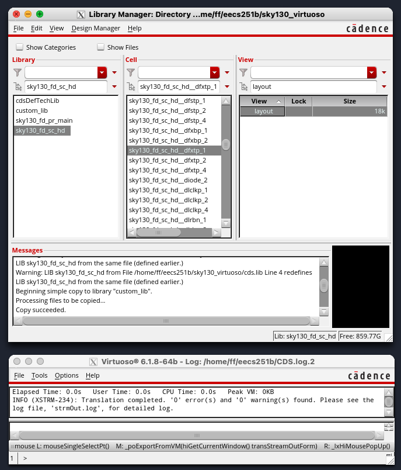
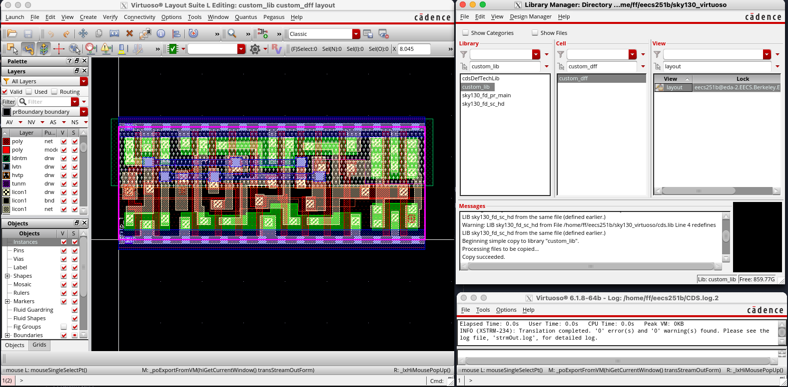

# Lab 4A: Custom digital design

We will now explore the process for designing custom digital circuits. We'll start with
a flow that uses VLSI tools to produce a layout, then explore an alternative flow that
allows full manual control of the layout for improved performance and area.

## Getting started

First, pull the latest changes to the lab Chipyard repository:

```
cd /scratch/$USER/chipyard
source env.sh
git pull skeleton main
./scripts/init-vlsi.sh
```

## Decoder VLSI

The file `vlsi/lab4/decoder.yml` contains the Hammer inputs for the 4-16 decoder 
we will be working with.

Synthesis, PAR, and LVS all need to be run before you can proceed. 

```
cd vlsi
./lab4-vlsi syn -e env.yml -p tools.yml -p lab4/sky130.yml -p lab4/decoder.yml --obj_dir build/lab4
./lab4-vlsi syn-to-par -e env.yml -p build/lab4/syn-rundir/syn-output-full.json -o build/lab4/par-input.json
./lab4-vlsi par -e env.yml -p build/lab4/par-input.json --obj_dir build/lab4
./lab4-vlsi par-to-lvs -e env.yml -p build/lab4/par-rundir/par-output-full.json -o build/lab4/lvs-input.json
./lab4-vlsi lvs -e env.yml -p tools.yml -p build/lab4/lvs-input.json --obj_dir build/lab4
```

> [!IMPORTANT]
> **Question 1.** What do the `syn-to-par` and `par-to-lvs` steps do? What are their inputs and outputs?

For this lab, we are using the custom Hammer driver `lab4-vlsi`. Open `lab4-vlsi` and inspect its contents.

The file contains a `Eecs251bDriver` class that extends the base `HammerDriver` class, but
removes a couple of steps.
In addition to removing steps, you could conceptually use this file to add your own custom steps using
[hooks](https://hammer-vlsi.readthedocs.io/en/latest/Hammer-Use/Hooks.html). This is especially useful
for injecting custom TCL that doesn't fit into a Hammer API (any real tapeout will 
certainly have some custom TCL). 

> [!IMPORTANT]
> **Question 2.** Why do we need to remove the `clock_tree` step for this decoder? It may help to look
> at the Verilog at `vlsi/lab4/decoder.v`.

### Parasitic extraction (PEX)

We will be using Cadence Quantus to run parasitic extraction. Parasitic 
extraction will produce a netlist with more accurately modeled capacitances and
resistances for the nets in the design. We can then simulate this netlist
to get more accurate results than just the original post P&R netlist. 

We will manually run the PEX flow since Hammer does not yet have a Quantus plugin.
First, let us set up a run directory by running
the following in the `vlsi/` directory:

```
mkdir -p build/lab4/pex-rundir
cd build/lab4/pex-rundir
```

Using a text editor of your choice, create a file called `quantus.ccl` in `build/lab4/pex-rundir/` 
that contains the following contents:

```
extract -selection "all" -type "rc_decoupled"
input_db -type pegasus \
  -directory_name ../lvs-rundir \
  -run_name "decoder"
output_setup \
  -file_name "decoder.post.sp" \
  -net_name_space "LAYOUT" \
  -temporary_directory_name "decoder"
process_technology \
  -technology_directory "/home/ff/eecs251b/sky130/sky130_cds/sky130_release_0.0.1/quantus/extraction/typical"
```

Then, run the following command:

```
quantus -cmd quantus.ccl
```

This will output the post-extraction netlist to `decoder.post.sp`.

> [!IMPORTANT]
> **Question 3.** PEX adds additional resistors and capacitors to the netlist.
> Looking through `decoder.post.sp`, find one line that instantiates a resistor and another that instantiates
> a capacitor. Include both lines in your report. As a hint, resistor instance names start with `R` and capacitor
> instance names start with `C`.

> [!TIP]
> It is recommended that you familarize yourself with basic SPICE syntax. [Here](https://eee.guc.edu.eg/Courses/Electronics/ELCT503%20Semiconductors/Lab/spicehowto.pdf) is one tutorial,
> but there are many others available online.

### Extracted simulation

We will now use Spectre to simulate post-extraction
decoder. 
If you are not familiar with Spectre, you can refer to the [reference manual](https://ee.kpi.ua/~yv/edu/ok/book/spectre_refManual.pdf) to learn about basic netlist syntax
and simulation commands.

We have supplied you with `decoder_testbench.sp`, which has the
testbench mostly setup for you already. Currently, it is intended that only `a0` is driven while the
remaining `a1-3` are held low (at `vss`). You will need to modify the connections to your decoder
since the port order of the post-extraction netlist is somewhat random. 

> [!WARNING]
> If you are not getting the expected results, double check your port ordering. SPICE is sensitive to
> port ordering, and new PEX runs can change the ordering that your decoder expects.

Once you have fixed the connections, you can run the following:

```
spectre decoder_testbench.sp
```

This should produce a number of output files including `decoder_testbench.mt0`.
This file includes desired measurements, such as the rise time `tplh` and the average
power `vdd_power`.
To view the waveforms produced by the simulation you can use Cadence Viva:

```
viva &
```

In the viewer that opens, click `File > Open Results`. Select the `decoder_testbench.raw` directory and click `Ok`. You should
now be able to click through the testbench hierarchy and add signals to the
waveform viewer.

> [!IMPORTANT]
> **Question 4.** Simulate the extracted decoder and measure the delay from `A[3]` rising 
> (the rest are 0) to `Z[8]` rising and the average power.
> Report the measured delay and average power, as well as the output load capacitance you used.
> You will need to modify the testbench
> such that A[3] is being driven and the other inputs are connected to ground.
> You may use the provided output capacitance if you would like, but it is always good to report delays
> with the output capacitance they correspond to.

## Custom design

> [!NOTE]
> The remainder of this lab will not be tied to Chipyard or Hammer. All of the relevant files will be included
> in this folder, which can be retrieved by running the following in your Lab 1 repo (the name should be
> something like `sp24-labs-rohanku`). If you did Lab 1 locally, you will need to redo the repo setup
> (cloning and adding a remote) on the instructional machines. 
>
> ```
> git pull skeleton main --allow-unrelated-histories
> ```
>
> For the remaining instructions, make sure you are in your lab repo, not your Chipyard repo.

Creating a custom cell involves creating a schematic (SPICE netlist)
and layout (GDS file), then verifying that the layout is manufacturable and matches the functionality
you expect. In the remainder of the lab, we will go through the process of creating and verifying a
SKY130 flip-flop.

Start by running the following commands from the root of your lab repo clone.

```
cd lab4a/dff
virtuoso &
```

This will open Virtuoso's command intepreter window (CIW). Go to `Tools > Library Manager`
in order to open the Library Manager window, as shown in Figure 2.

<p align="center">
 
    <br>
    <em>Fig. 2 - Virtuoso</em>
    </br>
</p>

In the Library Manager, you will notice that there is a technology library called
`sky130_fd_pr_main`. This library has all of the PDK primitives such as transistors
and capacitors.

We will be running the flow on a standard cell from the `sky130_fd_sc_hd` library.
To import this library, go to the CIW (small window) and click `File > Import > Stream` with Stream File as 
`/home/ff/eecs251b/sky130/sky130A/libs.ref/sky130_fd_sc_hd/gds/sky130_fd_sc_hd.gds` 
and `sky130_fd_sc_hd` as the library. Attach it to `sky130_fd_pr_main` in the `Technology` dropdown and click 
`Apply`. This will stream in the layouts for standard cells in SKY130.

> [!TIP]
> If you are unable to open the Library Manager in X2Go, you can try using SSH with X forwarding:
>
> ```
> ssh -AXY eecs251b-XXX@eda-X.eecs.berkeley.edu
> ```
>
> This may take some time to complete as it needs to start up XQuartz.
> When you start Virtuoso from your SSH terminal, a new window should open up in XQuartz.

### Schematic

The first step in designing a custom block is creating a schematic. This can be done in Virtuoso's schematic editor,
but it is often easier just to write a SPICE netlist. The SPICE netlist is provided for you in `lab4a/dff/custom_dff.spice` and is taken directly from SKY130's 
[`sky130_fd_sc_hd__dfxtp_1` netlist](https://github.com/google/skywater-pdk-libs-sky130_fd_sc_hd/blob/main/cells/dfxtp/sky130_fd_sc_hd__dfxtp_1.spice).

> [!IMPORTANT]
> **Question 5.** Looking at the netlist, which transistors are connected to the output of the DFF? Include the lines
> from the netlist that you used to determine this.

### Layout

We will be starting with an existing DFF layout.

Begin by creating a new library by going to `File > New > Library` in the
Library Manager and name it `custom_lib`. Then select `Attach to an existing 
technology library` and choose `sky130_fd_pr_main`. 
In the library manager, go to
`sky130_fd_sc_hd`, right-click on `sky130_fd_sc_hd__dfxtp_1`, and click `Copy`. In 
the new window, change the `To` library to be `custom_lib` and the cell to be 
`custom_dff`, and click `Ok`. 

Open the layout viewer by clicking on your custom cell and double-clicking its layout view.


<p align="center">
 
    <br>
    <em>Fig. 3 - Virtuoso layout viewer</em>
    </br>
</p>

> [!IMPORTANT]
> **Question 6.** Are the PMOS transistors on the top or the bottom of the layout? As a hint, find out where
> the n-well drawing layer is.
>
>
> **Question 7.** You might notice that there are VDD and VSS rails on metal 1 at the top and bottom of the standard
> cell. Which one is which and how did you determine this? You can either reason this using your previous answer
> or by hiding all of the objects other than labels in the bottom left panel.
>
> **Question 8.** You should never do this outside of this lab, but draw a rectangle that shorts only the VDD and VSS rails by
> selecting the layer you want to draw on, hitting `R`, and clicking to define the corners of the rectangle. Take a screenshot of the layout with VDD
> VSS shorted, then undo your change with `U`. You will want to draw the rectangle on metal 1 drawing and avoid
> running into other internal routing done on the same layer. Your rectangle does not need to be DRC clean, this
> is just to show you how routing signals together is done in manual layout.

We will pretend like you made the layout from scratch in Virtuoso. To convert the layout into something
we can run DRC on, we must export it to GDS. After reverting any changes you made, go to 
`File > Export Stream from VM` in the layout viewer window. This will create a `custom_dff.gds` file 
in your `lab4a/dff/` directory that contains the layout
of your cell.

### DRC

To run DRC, run the following commands in your `lab4a/dff/` directory:

```
mkdir drc
cd drc
pegasus -drc -dp 12 -license_dp_continue -gds ../custom_dff.gds -top_cell custom_dff -ui_data \
  /home/ff/eecs151/fa23/pdk_final/sky130_cds/sky130_prelim_release_091123/pegasus/sky130_rev0006.drc.pvl
```

To open the results viewer, run the following:

```
pegasusDesignReview -qrv -data ../custom_dff.gds &
```

Then, click `Pegasus > Open Run` and select the file ending with `.drc_errors.ascii` (the name may look a little
random).

> [!IMPORTANT]
> **Question 9.** Read this DRC error and explain what the error is. What is the purpose and
> operation of a tapcell? You can look at an SKY130 tapcell layout in the the same
> `sky130_fd_sc_hd` library we copied the DFF layout from.

### LVS

To run LVS, run the following commands in your `lab4a/dff/` directory:

```
mkdir lvs
cd lvs
pegasus -lvs -dp 12 -license_dp_continue -automatch -check_schematic -rc_data -ui_data \
  -source_cdl ../custom_dff.spice -gds ../custom_dff.gds -source_top_cell custom_dff -layout_top_cell custom_dff \
  /home/ff/eecs151/fa23/pdk_final/sky130_cds/sky130_prelim_release_091123/pegasus/sky130_rev0001.lvs.pvl
```

> [!IMPORTANT]
> **Question 10.** Take a screenshot of the LVS output that shows that layout and schematic match.

### PEX

To run PEX, set up a run directory by running the following from your `lab4a/dff/` folder.

```
mkdir pex
cd pex
```

Using a text editor of your choice, create a file called `quantus.ccl` in `lab4a/dff/pex/` 
that contains the following contents:

```
extract -selection "all" -type "rc_decoupled"
input_db -type pegasus \
  -directory_name ../lvs \
  -run_name "custom_dff"
output_setup \
  -file_name "custom_dff.post.sp" \
  -net_name_space "LAYOUT" \
  -temporary_directory_name "custom_dff"
process_technology \
  -technology_directory "/home/ff/eecs251b/sky130/sky130_cds/sky130_release_0.0.1/quantus/extraction/typical"
```

Then, run the following command:

```
quantus -cmd quantus.ccl
```

### Extracted simulation

Finally, we will do a couple more simulations to compare the extracted netlist to the original netlist.
You should be able to use a very similar testbench to the one
used earlier for the decoder. We have included an example Spectre testbench at
`lab4a/dff/dff_testbench.sp` that may be useful to you. 

> [!WARNING]
> Make sure to check the ordering
> of the ports of your post-extraction DFF netlist. The VNB port, which corresponds to NMOS bodies, should
> be connected to ground. Conversely, the VPB port corresponding to PMOS bodies should be connected to VDD.

> [!IMPORTANT]
> **Question 11.** Estimate the CLK-Q time of your DFF for a rising Q transition using both the pre-extraction (`custom_dff.spice`)
> and post-extraction (`pex/custom_dff.post.sp`) netlists. Compare the two times and provide an explanation
> for your observations.
> State the load capacitance and rise/fall times you used.

> [!TIP]
> Instructions on opening waveforms
> using Cadence Viva can be found in the extracted simulation section for the [decoder](#decoder-vlsi).

You can also extend the given testbench to characterize the setup time of your DFF.
The measurement can be performed by varying the D-CLK time in the testbench. If you start
with the data launch well before the clock rising edge, CLK-Q delay will only change
slightly. However, as the data edge draws closer to the clock edge, CLK-Q delay will rapidly increase until the data output can no longer be observed.
In this lab, we will use the definition of setup time as the D-CLK delay where the CLK-Q delay is 1.05 times
the CLK-Q delay for a very large D-CLK delay. You will learn more about the setup time during the lecture.

> [!IMPORTANT]
> **Question 12.** Modify `dff_testbench.sp` to estimate the setup time of your DFF using only the
> extracted netlist. State the load capacitance and rise/fall times you
> used, even if they are the same as the provided numbers. 
> Also, include a screenshot of the waveforms of CLK, D, and QN for the
> simulation that you determined the setup time from. 
>
>
> **Question 13.** Compare your setup time result to the timing parameters for
> `sky130_fd_sc_hd__dfxtp_1` in
> `/home/ff/eecs251b/sky130/sky130A/libs.ref/sky130_fd_sc_hd/lib/sky130_fd_sc_hd__tt_025C_1v80.lib`.
> Copy the entire section of the lib (starting at "timing () {}") that
> corresponds to the setup time and try to guess why it is presented as a look-up
> table instead of a single value. As a hint, you
> can find the table units and templates at the top of the file, and then find the
> timing lookup tables for CLK-Q, setup, etc. by searching for the
> `sky130_fd_sc_hd__dfxtp_1` entry.

## Conclusion

This lab is part A of an introduction to custom design flow. Part B will explore how you can incorporate your
custom cell that you have verified using DRC, LVS, and PEX into digital flows by generating files that specify
the pin location and timing of your block.

## Deliverables

Push your changes to the following files. Do not push any generated files as these will clutter up your repo.

Chipyard repo:
- `vlsi/lab4/decoder_testbench.sp`

Lab repo:
- `lab4a/dff/dff_testbench.sp`: Should contain your testbench for determining setup time.

Submit your answers to all of the questions to Gradescope. When taking screenshots, make sure to include
something that identifies that the screenshot is yours (e.g. a path to your repo or your terminal prompt).
