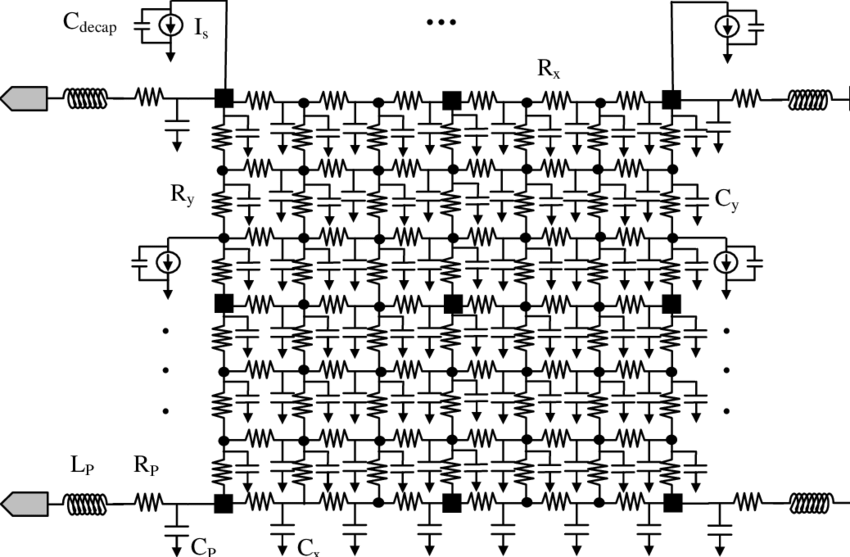

# Lab 5: Power and Rail Analysis

## Overview 
In prior labs, you increasingly dove deeper into the details of VLSI design,
all the way down to the custom design flow. In this lab, we will explore power
consumption using different analysis methodologies for a small RocketChip
configuration from Chipyard.

## Getting Started

We will once again start with updating our environment. Pull the latest
changes to your local Chipyard repository.

```
cd /scratch/$USER/chipyard
source env.sh
git pull skeleton main
./scripts/init-vlsi.sh sky130
```

Then, run the flow on the `SramBistConfig`. You can also choose to use a different config,
though you will need to place the necessary SRAMs. This will take a few hours
through elaboration/SRAM mapping (as seen in Lab 2), synthesis, and P&R. Be mindful of
compute resource utilization as well, since the tools will use bursts of 8 CPU
cores. Continue reading through the lab while everything is running.

```
cd vlsi
make CONFIG=SramBistConfig par 
```

> [!WARNING]
> 
> Even if you already ran P&R in Lab 2, run P&R again to ensure that the tools are
> using the latest configuration.

## Post-P&R Questions 

You can come back to answering these
questions after reading the next section and P&R finishes.

> [!IMPORTANT]
> **Question 1.** What is the clock period and uncertainty? Does it meet timing post-P&R?
> Are any of the SRAMs for the caches in the critical path? If not, where do they
> rank in the list of longest paths?
> 
>
> **Question 2.** Open up the final Innovus database with the `open_chip` script as
> before. Turn off all the metal layers. Then, highlight all instances of
> `DECAP*` cells using the command below and submit a screenshot in your lab report:
>
> ```
> select_obj [get_db insts -if {.base_cell.name == *decap*}]`
> ```
> 
>
> **Question 3.** Now go to the "amoeba" view (purple blob icon on the top right).
> Right-click the center of the floorplan and select "Ungroup". You may first need
> to left click to select all of the instances in the `system` module.
> Do this once more, then click off
> the floorplan. Submit a screenshot of this, and then estimate the percent of
> the core area (the floorplan excluding cache SRAMs) that the tile
> (`system/tile_prci_domain`) consumes.
> 
>
> **Question 4.** Determine the power strap widths and set-to-set spacing on layers M3
> through M9 by looking through the source TCL files used in P&R. Estimate the
> the density of the straps on each layer and correlate this with the
> `par.generate_power_straps_options.power_utilization` settings in
> `design.yml`.

## Cadence Voltus

Cadence Voltus is a tool that performs power and rail analysis on
your physical designs. Power analysis is pretty self-explanatory; rail analysis
uses the current consumption from power analysis and finds out how much voltage
is dropped over the power and ground power supply nets due to resistance in the
power grid (IR drop) and supply/ground bounce from switching events and
insufficient supply decoupling capacitance. An illustration of a real power
grid network is shown for one supply in Fig. 1, indicating how there are
wirebond resistances and inductances, supply grid resistances, and capacitances
with other supply nets (e.g. ground for a single-supply design like ours). The
flow we have can also analyze
[electromigration (EM)](https://en.wikipedia.org/wiki/Electromigration), which
is a wire failure phenomenon caused by current pushing metal atoms to/away from
where they were manufactured.

There are also advanced tools such as power gating, package/through-silicon via
(TSV) analysis, "what-if" rail analysis, self-heating, body bias, and ESD
analysis that we will not explore in this lab. Refer to the Voltus user guide
at `/share/instsww/cadence/SSV181/doc/voltusUG/voltusUG.pdf` for everything it
can do. The following is a summary of the power and rail analysis flow
as implemented in Hammer:

- ***Power Grid Library Generation***: Done in the `init_technology` step, the
  technology standard cells and any macros have their power and ground supplies
  characterized for resistance, capacitance, etc. The characterization
  (depending on the fidelity) requires the wire parasitic information, Spice
  models, and geometry information (LEF, GDS) to run a brief set of
  simulations. These libraries are then used during rail analysis below. 
- ***Design initialization***: The Innovus database is read in the
  `init_design` step. This database contains not only geometry information but
  also timing information across corners, which is used during dynamic analysis
  below.
- ***Static power analysis***: Done in the `static_power` step, this is a power
  calculation based on average switching power (1/2 &#945; C VDD^2 f as you
  have seen many times). An activity factor of 0.2 is assumed by default.  This
  is then summed with internal power (charging/discharging of interconnect and
  device capacitances internal to cells and characterized in LIBs) and leakage
  power (also from LIBs). 
- ***Static rail analysis***: Done in the `static_rail` step, this uses the
  average current numbers from static power analysis for each instance and uses
  it to calculate the IR drop on the power supply grid. There are many reports
  and pictures generated to help visualize where the worst IR drop regions are.
- ***Dynamic power analysis***: Done in the `active_rail` step, this is
  a more detailed power calculation based on probabilities of switching events
  on all nodes as calculated from a timing database (vectorless) and actual
  logic switching waveforms from simulation (vector-driven). In our case, our
  simulation waveform is from the simulation on the RISCV binary post-P&R.
- ***Dynamic rail analysis***: Done in the `active_rail` step, this takes the
  current information from dynamic power analysis and provides a more detailed
  picture of IR drop. If simulation waveforms or activity files don't exist, it
  will only analyze the vectorless power characterization.

*Note that rail analysis is not currently covered in this lab due to issues with the PDK and generation of PGV libraries.*

<p align="center">
 
    <br><em>Fig. 1 - RLD model of supply grid network</em></br>
</p>

## Running Power Analysis

We will manually run power analysis from the end of P&R because the default
`power-par` Make target expects a post-P&R simulation before running
post-P&R power analysis: 

```
./eecs251b-vlsi par-to-power -e env.yml \
  -p build/chipyard.harness.TestHarness.SramBistConfig-ChipTop/par-rundir/par-output-full.json \
  -o build/chipyard.harness.TestHarness.SramBistConfig-ChipTop/power-input.json \
  --obj_dir build/chipyard.harness.TestHarness.SramBistConfig-ChipTop

./eecs251b-vlsi power -e env.yml \
  -p build/chipyard.harness.TestHarness.SramBistConfig-ChipTop/power-input.json \
  --obj_dir build/chipyard.harness.TestHarness.SramBistConfig-ChipTop
```

> [!IMPORTANT]
> **Question 5.** In your lab report, draw a very simplified model of an inverter being
> supplied by a power and ground network with finite resistance.  Then, draw a
> series of waveforms showing what the voltage on the power and ground nets of
> the inverter would look like driven by a clock signal, with and without
> additional decoupling capacitance. These waveforms should be qualitative--no
> numbers required.
> 
> Drawings to submit:
> - Circuit model (label decaps) 
> - Input clock waveform
> - Output waveform 
> - Current draw from VDD 
> - Current sinking to VSS
> - VDD voltage w/o decap 
> - VDD voltage w/ decap 
> - VSS voltage w/o decap 
> - VSS voltage w/ decap
> 
> 
> **Question 6.** Concisely describe how IR drop and ground bounce as you have drawn above
> can affect the following: gate delay/setup/hold times, setup time margin, and
> hold time margin. Make sure to note all of the physical circuit changes that
> affect these parameters and include diagrams where helpful.
> 
> 
> **Question 7.** As you observed in the P&R database, the power straps on the lower
> layers have VDD and VSS paired together. What is the benefit of doing this for
> a supply grid as opposed to having VDD and VSS straps at equidistant intervals
> across the design?

Now, let's dig through the reports from power analysis in our
`power-rundir`. For simplicity, let's examine everything for the setup corner.
Static power results are in the folder `staticPowerReports.<corner>`.
Vectorless dynamic power results are in `activePowerReports.<corner>`.
If you did post-P&R simulation (see next section), the dynamic vector-based
results are in similar folders appended by the generated SAIF file.

> [!IMPORTANT]
> **Question 8.** Compare the `power.rpt` files between the static and vectorless dynamic
> power analysis. Which one is higher? What does this say about the switching
> probabilities of this design as compared to the default activity factor?
> 
> 
> **Question 9** Enumerate things you can change (as many as you can come up with!) to
> preserve the amount of IR drop if the power strap density had to be cut in
> half. Hint: think floorplan, clocks, etc.

## Vector-based power analysis (optional)

To analyze the power of the `srambist` program, you should change to a slower clock period (e.g. 1ns+) to ensure that the design passes timing. 

> [!IMPORTANT]
> Run `make` in `/scratch/$USER/chipyard/tests/` directory before continuing to ensure that the `srambist.riscv` 
> binary is present.

Then, do:

```
make USE_VPD=1 CONFIG=SramBistConfig BINARY=/scratch/$USER/chipyard/tests/srambist.riscv power-par
```

This will also run a post-P&R simulation of the binary followed by power analysis. Note that the simulation may take a long time — it may even timeout if P&R was not clean. But, the vector-based dynamic power analysis should still work. Then, answer these questions:

> [!IMPORTANT]
> **Question 10.** Compare the vectorless and vector-based power. How does the benchmark's overall switching power compare to the vectorless assumption?
